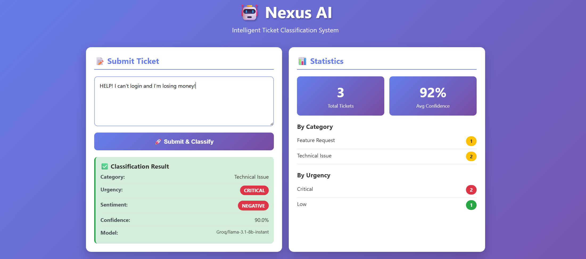
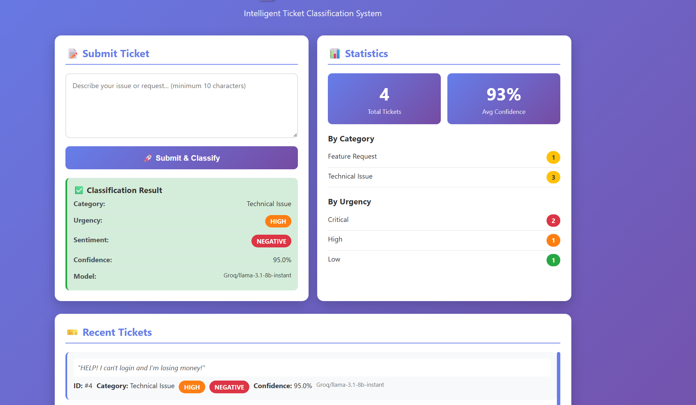

# 🤖 Nexus AI - Intelligent Ticket Classification System

AI-powered support ticket system that automatically categorizes, prioritizes, and analyzes customer support messages using real-time AI classification.

## 📸 Screenshots

### Frontend Dashboard


### API Documentation


---

## 🎯 Problem Statement

In real companies, **thousands of emails arrive daily**. Manual sorting is time-consuming and error-prone. This system:
- ✅ **Automatically categorizes** tickets (Technical, Billing, Feature Request, etc.)
- ✅ **Prioritizes urgency** (Critical → High → Medium → Low)
- ✅ **Analyzes sentiment** (Positive, Neutral, Negative)
- ✅ **Routes to correct teams** (Critical → Managers, Billing → Finance, Technical → Developers)

---

## 🚀 How It Works

1. **User submits** a support message (e.g., "URGENT! Server is down!")
2. **AI analyzes** the message using Groq/OpenAI
3. **System classifies** automatically:
   - **Category**: Technical Issue, Billing, Feature Request, Account, Bug Report, General Inquiry
   - **Urgency**: Low, Medium, High, Critical
   - **Sentiment**: Positive, Neutral, Negative
   - **Confidence**: 0-100% (how sure the AI is)
4. **Results saved** to database with full classification metadata

---

## 🛠️ Technology Stack

### Backend
- **FastAPI** - Modern Python web framework
- **Python 3.14** - Latest stable version
- **SQLAlchemy** - ORM for database management
- **Pydantic** - Data validation with type hints
- **SQLite** - Development database (PostgreSQL-ready)

### AI Layer
- **Groq API** - FREE ultra-fast LLM inference (llama-3.1-8b-instant)
- **OpenAI API** - Alternative provider support (gpt-3.5-turbo)
- **Structured Output** - JSON-validated AI responses

### Frontend
- **React 18** - Modern UI library (via CDN)
- **Vanilla CSS** - Custom gradient design
- **Babel Standalone** - In-browser JSX compilation
- **No build step required** - Direct browser usage

---

## Architecture Principles

- Clean separation: Router → Service → Repository

- AI logic isolated in AI Service layer

- No blind trust in LLM output

- Full request/response logging

- Prompt version traceability

- Cost observability

## Current Version Features

Version 1 → AI Classification (with DB)
Version 2 → RAG
Version 3 → Agent Orchestration

### ✅ Version 1: Mock AI System
- Basic FastAPI setup with clean architecture
- Mock keyword-based classifier (no API keys needed)
- PostgreSQL-compatible database schema
- CRUD operations (Create, Read, List, Statistics)
- Logging & error handling

### ✅ Version 2: Real AI Integration
- **Groq API integration** (FREE & ultra-fast)
- **OpenAI API support** (gpt-3.5-turbo)
- Provider switching via environment variable
- Automatic JSON extraction from AI responses
- Confidence scoring & model version tracking
- Configuration management with pydantic-settings

### ✅ React Frontend
- Beautiful gradient purple theme
- Real-time ticket submission & classification
- Live statistics dashboard
- Ticket history with color-coded badges
- Responsive design (mobile & desktop)
- No npm/build required - pure CDN
`
URGENT! Our production server crashed and 1000 customers can't access the website! Need immediate help!
`

**Expected Output:**
- Category: `Technical Issue`
- Urgency: `Critical` (red badge)
- Sentiment: `Negative`
- Confidence: `~92%`

### Example 2: Billing Question
**Input:**
`
Hi, I was charged twice for my subscription last month. Can you please refund one charge? Thanks!
`

**Expected Output:**
- Category: `Billing`
- Urgency: `Medium`
- Sentiment: `Neutral`
- Confidence: `~87%`

### Example 3: Feature Request
**Input:**
`
It would be amazing if you could add dark mode to the app! I use it at night and it's too bright.
`

**Expected Output:**
- Category: `Feature Request`
- Urgency: `Low`
- Sentiment: `Positive`
- Confidence: `~95%`

---

## Versions & DeadLines 
### Each time i apply different concepts from AI agent Theory in project.

**Version 1: AI Classification**
(User στέλνει πρόβλημα → AI επιστρέφει structured JSON → Αποθήκευση στο DB.)

- API Endpoints
- AI Layer
  - Prompt template
  - JSON structured output
  - Validation (Pydantic)
  - Retry on invalid JSON
  - Confidence score
- Database
  - Table: tickets
    - id
    - user_message
    - category
    - urgency
    - sentiment
    - confidence
    - ai_raw_response
    - model_version
    - created_at
- Engineering Features
  - Logging prompt + response
  - Error handling
  - Async LLM call
  - Clean architecture (router → service → repository)

Ερωτησεις που θα κανω στον εαυτο μου:
1. Ξέρεις structured extraction με σωστο τροπο η την εκανα λαθος εδω γιατι?
2. Ειναι αυτο το AI σε production-like flow η οχι?
3. Εμπιστεύετηκα τυφλά το LLM η οχι?

**Version 2: Database Integration**

Ερωτησεις που θα κανω στον εαυτο μου:
- Ειναι διαφορετικο αυτο για ΑΙ η το ιδιο οπως παντα?

**Version 3: RAG Implementation (AI + RAG)**

Νέα Features:
- Embeddings
  - Δημιουργία embedding για κάθε ticket
  - Αποθήκευση σε pgvector
- Similarity Search
  - Όταν έρχεται νέο ticket:
    - βρίσκεις 3 παρόμοια
    - τα βάζεις στο prompt
- Context Injection
  - Prompt: "Based on similar past issues: …"
- Database
  - Νέος πίνακας: ticket_embeddings
  - vector column
- Endpoint: POST /tickets/with-context

Ερωτησεις που θα κανω στον εαυτο μου:
- Καταλαβαίνεις RAG σωστα η οχι?
- Ξέρω embeddings πλεον η οχι? μηπως δεν τα κανω σωστα?
- Ξέρεις vector search η οχι με το σωστο τροπο?
- Ξέρεις knowledge grounding η οχι με το σωστο τροπο?

**Version 4: Agent Orchestration** (vasika 3 einai alla exw san 2 to DB integration)

Νέα Features:
- Tool Definitions
  - get_similar_tickets
  - assign_priority
  - escalate_ticket
- Agent Loop
  - LLM decides tool
  - Backend executes
  - Returns result
  - LLM continues reasoning
- Conversation State
  - session table
  - message history

Ερωτησεις που θα κανω στον εαυτο μου:
- Agent orchestration σωστα η οχι?
- Tool calling σωστα η οχι?
- State machine thinking σωστα η οχι?
- Production AI backend σωστα η οχι?

---
# What is missing for production project?
## 1. Guardrails

- ✅ **Strict JSON schema** - Structured output validation
- ✅ **Allowed categories only** - Predefined classification types
- ✅ **Output validation** - Pydantic schema enforcement
- ✅ **Retry mechanism** - Handles malformed AI responses
- ✅ **Error logging** - Complete request/response tracking

---

## 2. Cost Monitoring

- 📊 **Token usage logging** - Track input/output tokens per request
- 📊 **Model usage stats** - Endpoint for usage analytics
- 📊 **Provider comparison** - Groq vs OpenAI cost tracking
- 📊 **Confidence metrics** - Monitor AI classification accuracy

---

## 3. Prompt Versioning

All prompts are versioned and logged:
- **v1.0**: Basic classification template
- **v2.0**: RAG-enhanced context injection
- **v3.0**: Agent orchestration with tool calls

Each ticket stores the `model_version` used for classification, enabling:
- A/B testing of prompt variations
- Rollback to previous prompt versions
- Performance comparison across versions

---

## 📚 Learning Concepts

### ✅ Completed
- Structured output extraction
- Multi-provider AI integration
- Clean architecture patterns
- RESTful API design
- React frontend basics
- Configuration management

### Partial Fix
- RAG implementation
- Vector embeddings
- Semantic search
- Production guardrails

### Todo
- Agent orchestration
- Tool calling patterns
- State management
- Cost optimization
- Business Rule Override Layer
---

🔒 AI System Requirements (Production-Grade)

The system enforces the following guarantees:

### Deterministic Output

Strict JSON schema validation

Enum-based classification constraints

Bounded retry mechanism (max 2 attempts)

Fallback default classification

### Guarded Decision Layer

Confidence threshold handling

Manual review flagging

Business rule overrides AI decisions when necessary

No blind trust in model outputs

### Bounded Execution

Maximum token limits per request

Controlled retry logic

No infinite agent loops

Deterministic exit conditions

### Observability

Token usage per request

Cost estimation

Model usage tracking

Classification distribution metrics

Low-confidence monitoring

Latency tracking

### Prompt Lifecycle Control

Versioned prompts stored in database

Reproducible classification decisions

Rollback capability

Prompt updates without code redeploy

### Retrieval Grounding

Embedding storage

Vector similarity search

Context injection logging

Retrieval metadata tracking

### Data Flow

```
Client Request
     ↓
FastAPI Router (validates input)
     ↓
Service Layer (calls AI API)
     ↓
AI Provider (Groq/OpenAI)
     ↓
Response Parsing (extract JSON)
     ↓
CRUD Layer (save to database)
     ↓
Response to Client
```
---

## Todo Testing 

### Unit Tests
- AI service with mocked LLM responses
- CRUD operations with in-memory SQLite
- Schema validation (Pydantic)

### Integration Tests
- Full API flow (submit → classify → retrieve)
- Database operations with real PostgreSQL
- AI provider switching (Groq ↔ OpenAI)

### Load Tests
- Concurrent ticket submission
- Rate limiting validation
- Token usage monitoring

---

## 🤔 Engineering Questions to Validate

### Structured Extraction
- (Maybe) Do I validate JSON properly?
- (Maybe) Do I handle parsing failures gracefully?
- (Maybe) Is my schema flexible enough?

### Production Readiness
- (Maybe) Is error handling comprehensive?
- (Maybe) Are logs actionable?
- (Nah) Is rate limiting implemented?
- (Nah) Are costs tracked?

### AI Safety
- (Maybe) Do I validate LLM outputs?
- (Nah) Do I have hallucination guards?
- (Nah) Is confidence calibrated?
- (Nah) Human-in-the-loop for low confidence?ret
```

---

